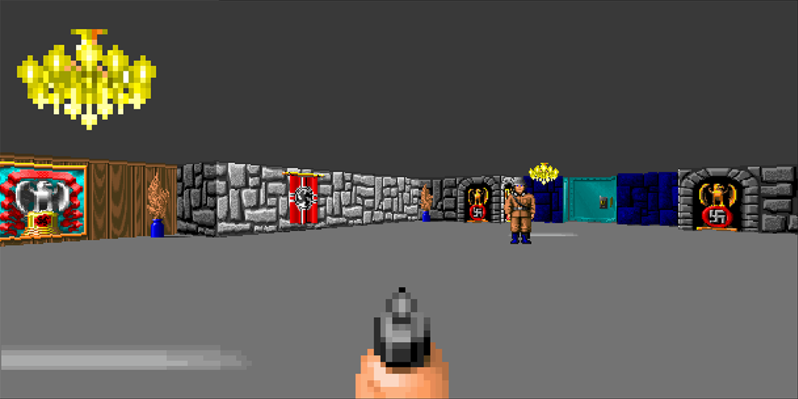

# F# / Fable Wolfenstein

A work in progress F# port of Wolfenstein 3D. Wolfenstein was a formative experience for me! I was big into my PC gaming and the shareware scene when it came out and I remember not knowing anything about it but downloading it from a BBS, installing it, and then excitedly running round the house proclaiming "THIS CHANGES EVERYTHING" over and over again. No one cared.

I had a go at writing a raycaster myself, in C, after I'd played this back in 92/93 and I did get something running but it was both slow and fish eyed. It remained an itch to be scratched and so this F# port seems to have somehow happened.

I've generally tried to keep things fairly functional with performance taking a bit of a hit in some cases as a result.

The engine will run in the browser using Fable or as a native app on Mac, Windows and Linux - I've only got a Mac to hand at the moment so that's all I've tested. In theory should work on other platforms...

The majority of the core code is shared between the two implementations though I didn't set off with multi-targetting in mind. I wrote the Fable version first and so if you look at the desktop code you will see I'm essentially writing some lightweight JS runtime (DataView predominantly) implementations.

Some of the code is rather scruffy and their are some arguments about ints and floats! Was learning as I went... Now its pretty much solved will slowly refactor into something cleaner over time. The Open GL code in the desktop port (I don't use OpenGL to render the game scene, rather I use it to render a single raycast texture) may look excessive - to expedite things I simply picked up some code from a virtual console I've been working on on and off for a year or two and used that.

I aim to at least get the AI working (and you can see the seeds of that in the code) and I will probably add the Wolfenstein health / info bar. Beyond that... don't know. Other fun projects to be built!

## Running

Controls in both cases:

Cursor keys - movement
Left Ctrl - fire
Space bar - action (e.g. open door)

### Browser

I've been using node 16 to compile this. 17 doesn't work at the moment.

To run the game:

* Navigate to the browser folder
* Install dependencies: `npm install`
* Start the compiler in watch mode and a development server: `npm start`
* After the first compilation is finished, in your browser open: http://localhost:8080/

To build it for distribution

* npm run build

### Desktop

You will need .net 6 installed to run this. To run the game:

* Navigate to the desktop folder
* Enter: `dotnet run`

## Implementation / File Format Notes

Things I found...

### Orientable Sprite Layouts

Orientable enemies (i.e. those that can face away from the player - e.g. guards, dogs etc.) have the following index layout (using a compass to define things as shown below):

       N            G
    W     E
       S            P

|Sprite| Faces direction  |
|------|------------------|
|0|S (towards player)| 
|1|SW|
|2|W|
|3|NW|
|4|N|
|5|NE|
|6|E|
|7|SE|

Their are then a number of repetitions of this block for various animation frames:

|Block| Description                                   |
|-----|-----------------------------------------------|
|0| Stationary - block of 8 sprites as above      |
|1| Running frame 1 - block of 8 sprites as above |
|2| Running frame 2 - block of 8 sprites as above |
|3| Running frame 3 - block of 8 sprites as above |
|4| Running frame 4 - block of 8 sprites as above |

The number of running frames can vary by enemy type - the above example is for a guard but a dog is different:

|Block| Description                                   |
|-----|-----------------------------------------------|
|0| Stationary - block of 8 sprites as above      |
|1| Running frame 1 - block of 8 sprites as above |
|2| Running frame 2 - block of 8 sprites as above |
|3| Running frame 3 - block of 8 sprites as above |

So their are 40 sprites for the position and movement state of each enemy.

Their are then an arbitary (per enemy type) number of death sprites and firing sprites.

### Sounds

|Sound Index|Description|
|-----------|-----------|
|0|Huh guards|
|1|Dog bark|
|2|Door close|
|3|Door open|
|4|Player machine gun|
|5|Player pistol|
|6|Or is this the player pistol?|
|10|Chain gun|
|11|Machine gun|
|20|Mein leben|
|21|Guard pistol|
|29|Double bark|
|32|Yeah|
|33|Shite|
|34|Aieeee|
|35|Ohohaw|

### Player -> Enemy Bullet Hit Detection

Considered a couple of approaches for detecting what, if any, enemy the player will hit if they fire. I could have cast a ray or rays but given the renderer has just walked the object tree and done the depth sorting and clipping I instead take note of the front most sprite that is in the centre of the viewport and apply a tolerance to it.

### Asset Extraction

Didn't really want to process WLx files by myself so I used a couple of tools to extract the assets.

Firstly [Wolf3dExtract](https://github.com/HiPhish/Wolf3DExtract) to retrieve the components and then [ImageMagick](https://imagemagick.org/) to convert textures from PPM to PNG format. 

## License

I've included the Shareware assets in this public repository. And all copyrights of the original game clearly remain with the copyright holders and all props to the geniuses behind the original game (I have no idea if Carmack, Romero, et al. are still copyright holders).

All my efforts (so the F# code and surrounding build systems) are under the MIT license.